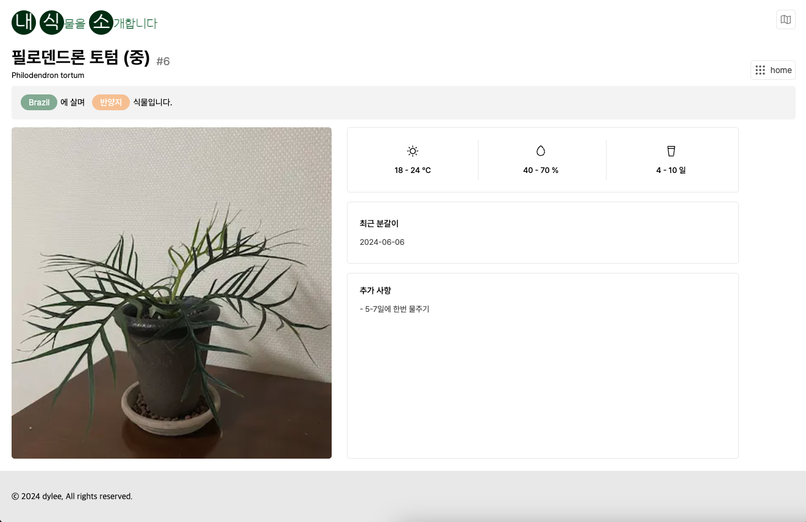
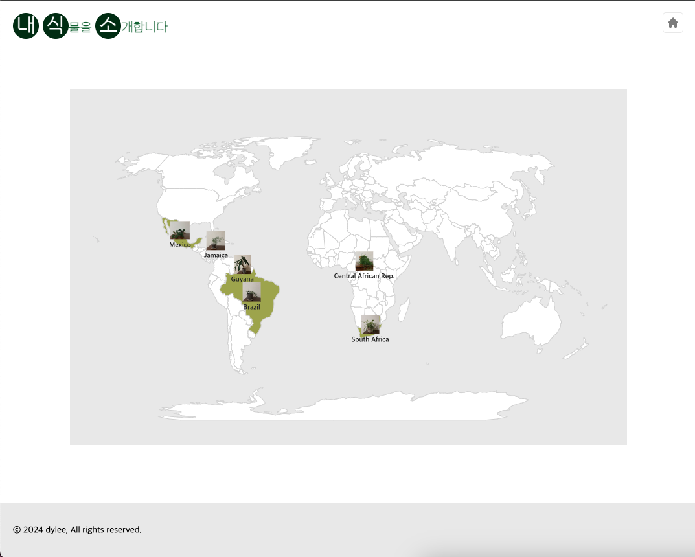

## 🪴 반려식물 관리 웹 Planteven - 내식소

 

・ 배포 URL : [https://planteven.vercel.app](https://planteven.vercel.app)

 

## Planteven 내식소 소개

- Planteven은 키우고 있는 식물들의 정보를 알기 쉽게 한 곳에 모아 적어둔 페이지입니다.
- 메인 페이지는 폴라로이드 사진 갤러리처럼 보이도록 구성했으며 간단한 정보들을 알 수 있게 구성했습니다.
- 상세 페이지는 폴라로이드처럼 보이는 부분을 누르면 진입 가능하며 물주기 등 식물 키우기에 필요한 상세한 정보들을 알 수 있도록 구성했습니다.
- world map 페이지는 식물의 자셍지를 d3.js를 활용하여 구현한 세계지도에 나타내어 식물 분포를 확인할 수 있게 구성했습니다.

 

## 개발 환경

- FE : Next.js, Typescript, emotion.js, d3.js, react-icons
- Deploy : Vercel
- Design : [Figma](https://www.figma.com/design/ThSqGsgV3WNA0iMfTwtZZO/Planteven---%EB%82%B4%EC%8B%9D%EC%86%8C?node-id=0-1&t=l75HWk9W5UhOgHbO-1)

 

## 페이지별 기능

### 메인 페이지

- 폴라로이드 갤러리 처럼 식물 사진을 모아서 보여주고 있습니다.
- 식물의 이름, 학명, 들여온 날 부터 얼마나 되었는지 등 을 알 수 있습니다.

| 메인 페이지 |
|----------|
|  |

 

### 상세 페이지

- 필요한 빛 조건, 온도, 물주기, 습도 등 추가적인 정보를 보여줍니다.
- 라벨을 통해 식물의 자생지, 빛 조건을 간편하게 알 수 있도록 구성했으며, 추가사항을 적을 수 있게 하여 개별 식물을 상세하게 관리할 수 있게 하였습니다. 

| 상세 페이지 |
|----------|
|  |

### World Map 페이지

- 등록된 식물들의 자생지를 world map에 나타내어 분포를 확인할 수 있게 하였습니다.
- world map 위의 라벨을 통해 어떤 식물의 자생지인지 확인할 수 있습니다.
- d3.js의 zoom 기능을 사용하여 지도 확대 ・ 축소가 가능하게 하였습니다.

| worldMap 페이지 |
|----------|
|  |

 

## 개선 사항

- world map 디자인 변경
- 반응형 웹페이지
  - 반응형 웹페이지로 구성하여 핸드폰으로도 볼 수 있도록 수정 예정
- DB 도입 고민
- 수정 페이지 만들지 고민