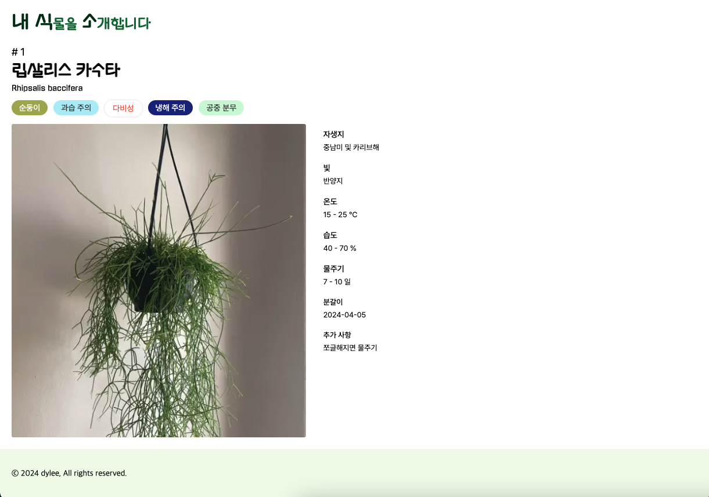

## 🪴 반려식물 관리 웹 Planteven - 내식소

 

・ 배포 URL : [https://planteven.vercel.app]("https://planteven.vercel.app")

 

## Planteven - 내식소 소개

- Planteven은 키우고 있는 식물들의 정보를 알기 쉽게 한 곳에 모아 적어둔 페이지입니다.
- 메인 페이지는 폴라로이드 사진 갤러리처럼 보이도록 구성했으며 간단한 정보들을 알 수 있게 구성했습니다.
- 상세 페이지는 폴라로이드처럼 보이는 부분을 누르면 진입 가능하며 물주기 등 식물 키우기에 필요한 상세한 정보들을 알 수 있도록 구성했습니다.

 

## 개발 환경

- FE : Next.js, Typescript, emotion.js
- Deploy : Vercel
- Design : [Figma]("https://www.figma.com/design/ThSqGsgV3WNA0iMfTwtZZO/Untitled?node-id=7-52&t=l75HWk9W5UhOgHbO-0")

 

## 페이지별 기능

### 메인 페이지

- 폴라로이드 갤러리 처럼 식물 사진을 모아서 보여주고 있습니다.
- 식물의 이름, 학명, 들여온 날 부터 얼마나 되었는지 등 을 알 수 있습니다.

| 메인 페이지 |
|----------|
|  |

 

### 상세 페이지

- 필요한 빛 조건, 온도, 물주기, 습도 등 추가적인 정보를 보여줍니다.
- 라벨을 통해 실내 식물로 키우는 난이도, 냉해 유무, 비료 요구도 등 을 간단하게 파악할 수 있습니다.

| 상세 페이지 |
|----------|
|  |

 

## 개선 사항

- DB 사용
  - DB를 사용하여 추가, 수정 및 삭제가 가능하도록 구현 예정
  - 물주기 DB를 사용하여 관련 알림 추가 예정
- 이미지 변경
  - 웹 이미지에서 직접 찍은 이미지로 수정 예정